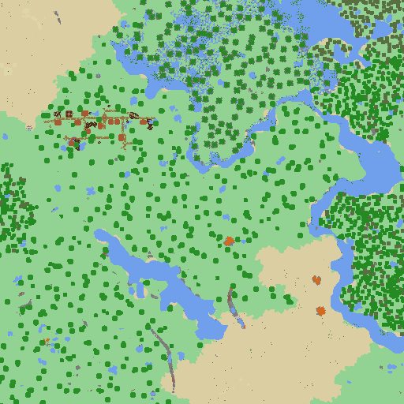

# mine_viewer
Mine viewer is a cross platform (MacOS/Linux/Windows) command line application to render top views of minecraft worlds (>=1.13).

## Instructions
### Executing
To run mine_viewer just type

`cargo run --release -- the arguments you want to pass`

You can run the application with `--help` to get a list of all arguments and uses.

The application requires 3 minecraft folders found in the .jar of minecraft to read all the textures and render the world: `blockstates`, `models` and `textures`. All three folders are located inside the .jar of minecraft in `assets/minecraft`. Use files from a `.jar` of the same minecraft version of the world you want to render. On windows you can set the file extension to `.zip` to access the internal files.

To download the .jar file you can either use a minecraft launcher and search in the `.minecraft` directory or download it from [mcversions](https://mcversions.net/).

The `--region` argument can be used to set the path for the region directory of your minecraft world. By default mine_viewer will look for a folder named `region` in the same location as the executable/cargo directory.

In the `images` folder you will find all generated textures for each world, in separate folders, with one texture per sector (16x16 chunks). But you will also find a collage.png of all the images sticked together.

### Settings
Settings for the world rendering are found in the `settings` folder, which contains two files:

* `biome_blocks.json` describes how blocks which change in each biome should be tainted. This is needed as the textures for these blocks and in black and white. The program doesn't distinguish between biomes as the games does, and only one variation is used.

* `ignore_blocks.json` is a list of blocks that should not be rendered and be ignored by the application.

## Renders:

